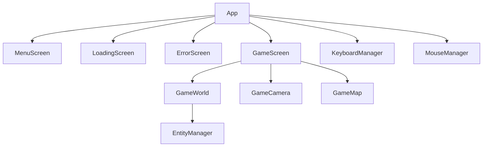

# GemDino

My first RPG game made with java. It was a great experience.

# History

// Decompiled by Procyon v0.5.36

# Structure

Every children does not have direct access to their parent.\
They have access to the `App` and from the `App` they have access to their parent.
